<style>
.hljs-variable { color: lightblue }
.hljs-string { color: lightgreen }
</style>
<!--
_backgroundImage: "linear-gradient(to bottom, #000 0%, #1a2028 50%, #293845 100%)"
_class: lead
_color: white
_paginate: false
_footer: ""
-->

# <!-- fit --> Data Engineering, который смог
### (в DevOps)

Паша Финкельштейн, JetBrains

---
<!--
_backgroundImage: "linear-gradient(to bottom, #000 0%, #1a2028 50%, #293845 100%)"
_class: lead
_color: white
-->
# Кто я

- 14 лет в IT
- Сначала админ
- Потом разработчик
- Занимался DevOps до того, как это стало трендом :wink:
- Управлял разработчиками
- А потом *внезапно* стал дата инженером

---

<!--
_backgroundImage: "linear-gradient(to bottom, #000 0%, #1a2028 50%, #293845 100%)"
_class: lead
_color: white
-->
# <!-- fit --> Дата инженером? :scream:

---
<!--
_backgroundImage: "linear-gradient(to bottom, #000 0%, #1a2028 50%, #293845 100%)"
_color: white
-->
# <!-- fit --> Дата инженером? :scream:
* big learning
* machine data
* это не мы
---
<!--
_backgroundImage: "linear-gradient(to bottom, #000 0%, #1a2028 50%, #293845 100%)"
_color: white
-->
# А чем тогда?

- Поддержка инфраструктуры
- Архитектура системы хранения
- Автоматизация рутины
- ETL

---
<!--
_color: white
_class: lead
-->
<style scoped>
footer {
    color: white
}
</style>


# Вильгельм

---
<!-- _class: lead -->


# Это Вильгельм

Он занимается маркетингом

---
<!-- _class: lead -->


# Это Элеонора

Она работает SRE

---
<!-- _class: lead -->


А это бизнес, который им платит

---
## Что нужно бизнесу

- Основной инструмент бизнеса — это эксель
- Из него можно подключиться к БД
- В него можно выгрузить данные из Google Analytics
- В нём можно посчитать всякие аудитории
- etc…

---
## Но со временем

- Количество данных растёт
- Становится сложно работать в одном файле
- Становится слишком много ручной работы

---
<!-- _class: lead -->


# Кажется, нам нужно хранилище данных!

---
<!-- 
_class: lead
_color: black
-->


# <!-- fit --> Что же делать? :scream:

---
# Hadoop!

- Бесплатно
- Умеет всё
- Можно купить версию с поддержкой
- *Никто* не умеет готовить

---
# Что значит «всё»?

- SQL
- NOSQL
- Файлы
- Движки запросов
- Движки ETL
- **YARN**!

---
<!-- _footer: "" -->
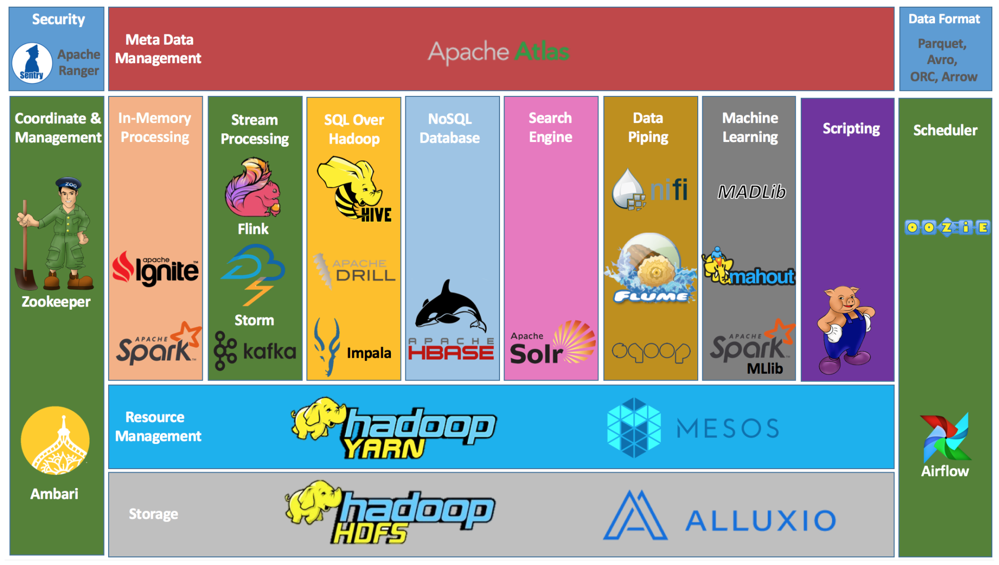

---
<!-- _footer: "" -->
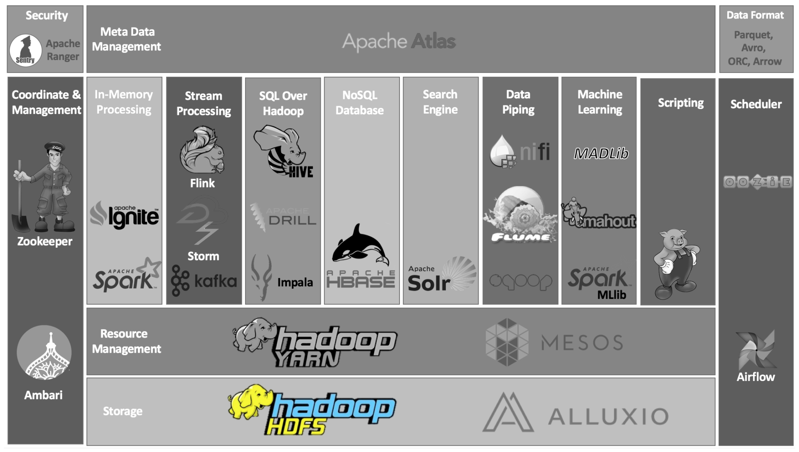

---
<!-- _footer: "" -->
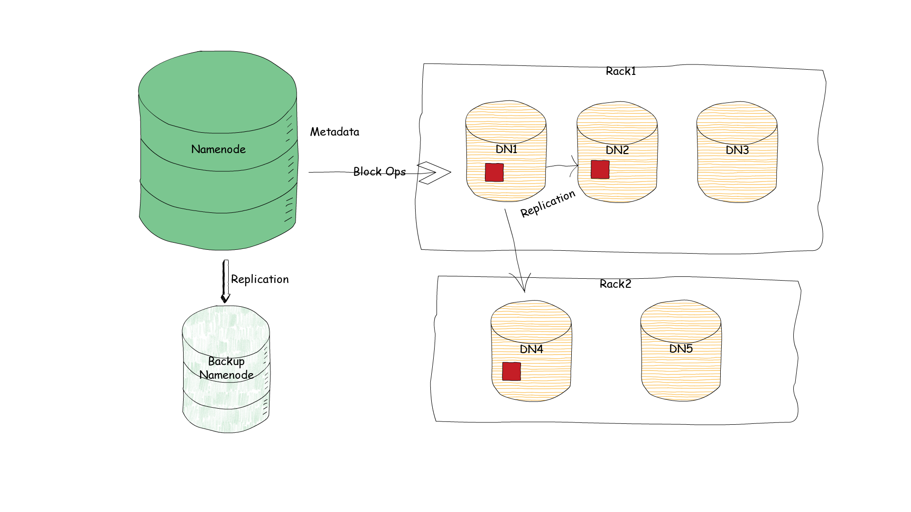

---
<!-- _footer: "" -->
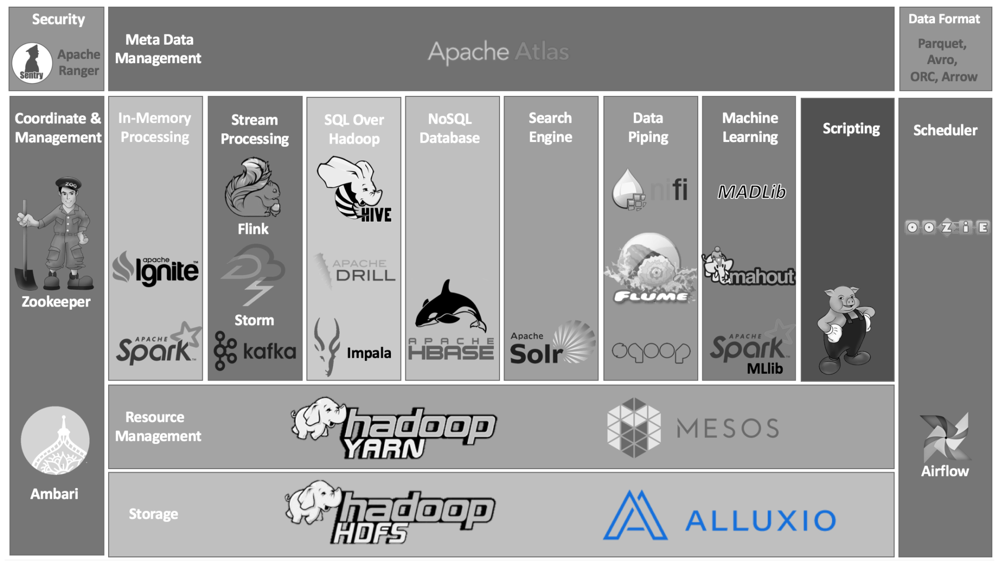

---
<!-- _footer: "" -->
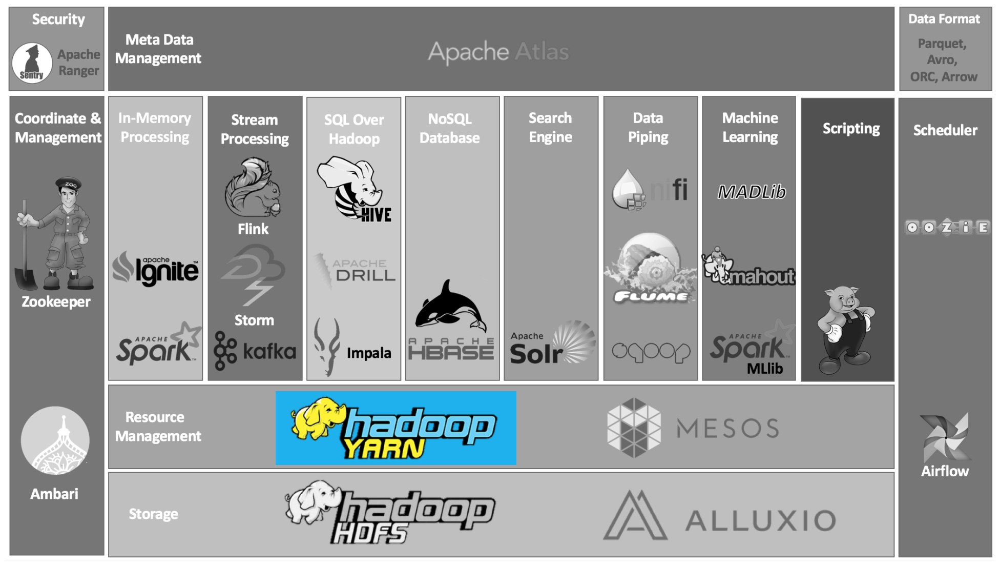

---
<!-- _footer: "" -->
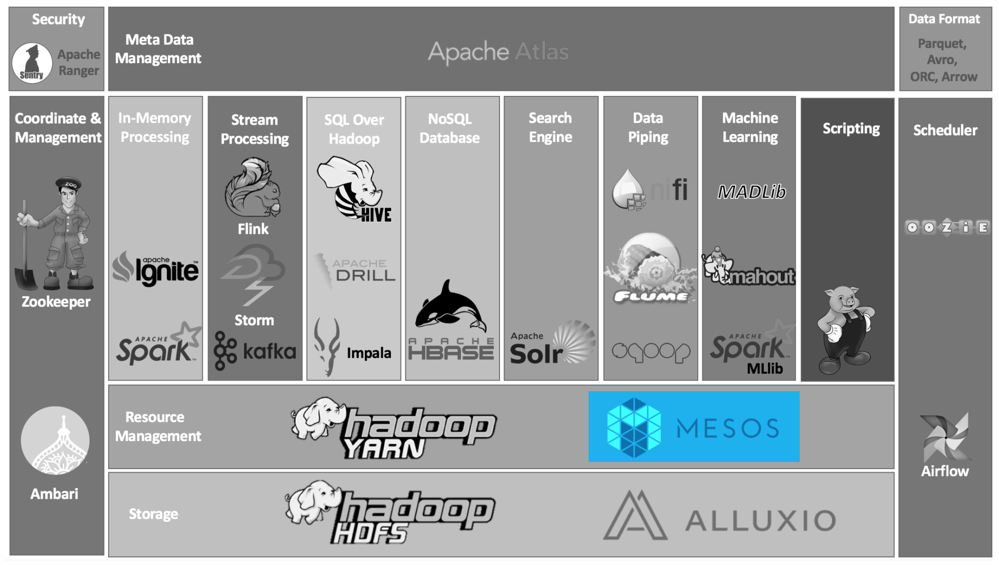

---
<!-- _footer: "" -->
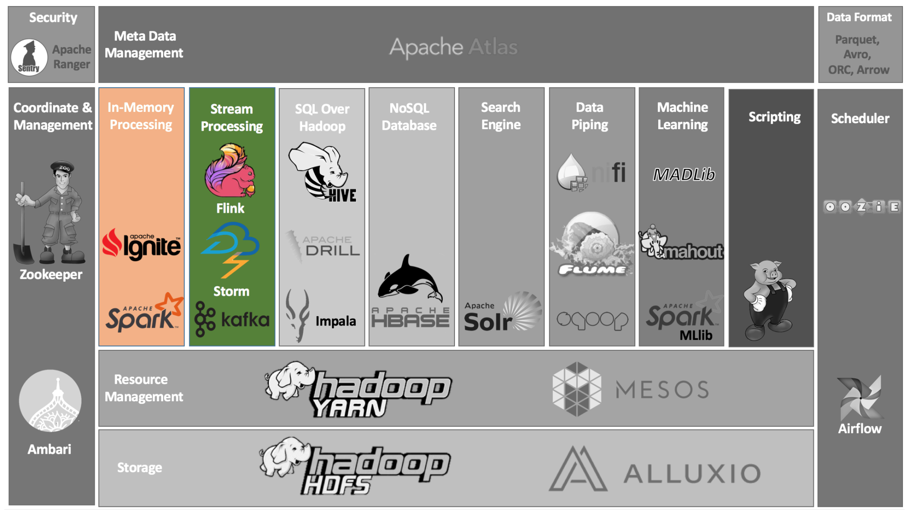

---
<!-- _footer: "" -->
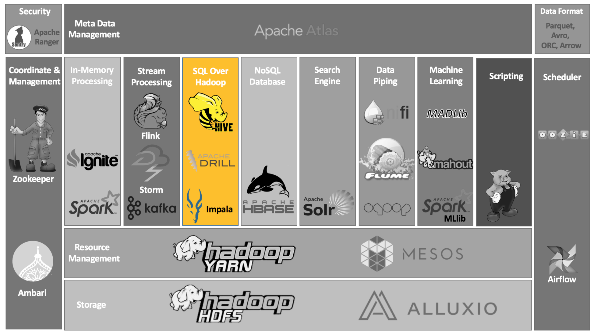

---
<!-- _footer: "" -->
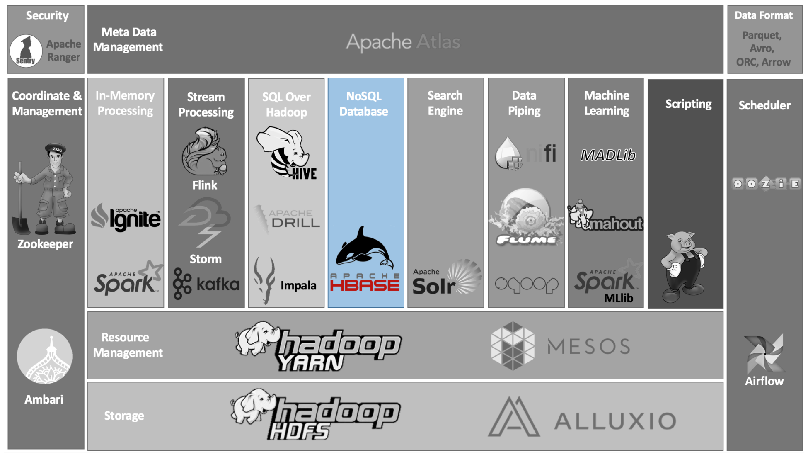

---
<!-- _footer: "" -->
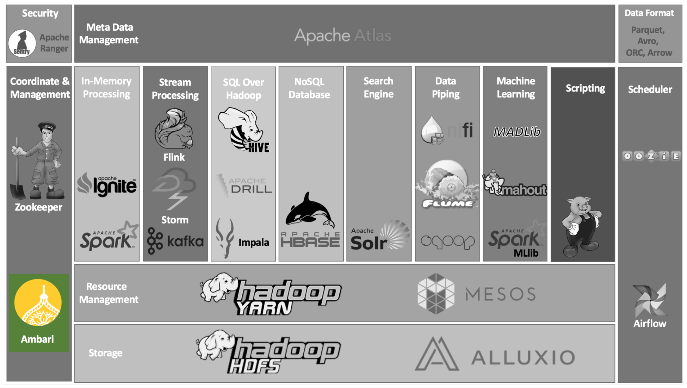

---
<!-- _footer: "" -->
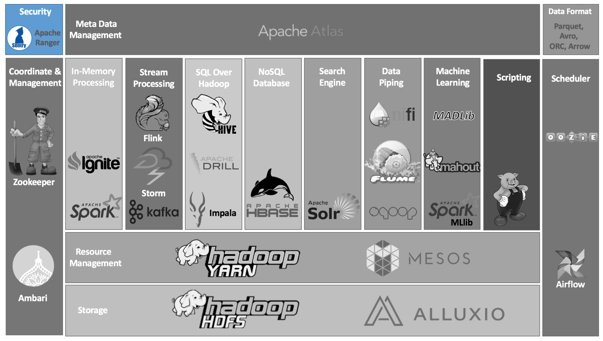

---
<!-- _footer: "" -->
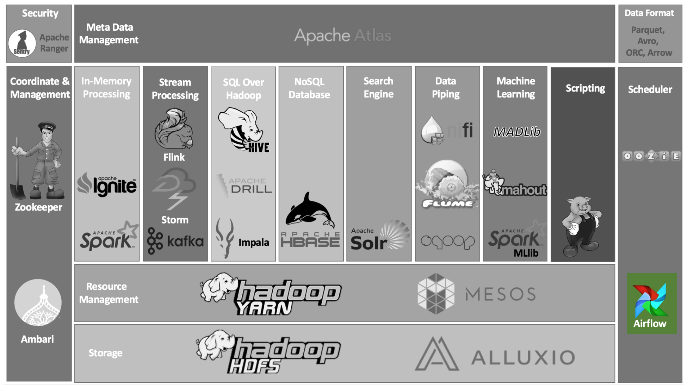

---
<!-- _footer: "" -->
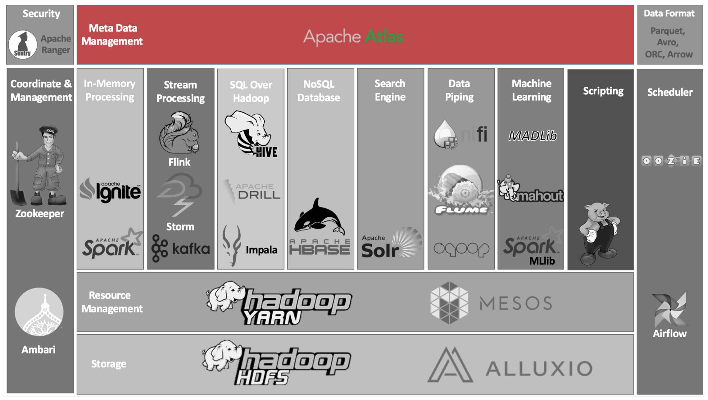

---
## Шаг 1

1. Без паники
2. Открываем этот доклад
3. Ищем волшебное слово **«Ambari»**

---
### Ambari

Даёт нам простой (сравнительно) способ установки и настройки хадупа

```bash
yum install ambari-server*.rpm
ambari-server setup
ambari-server start
# agents
yum install ambari-agent*.rpm
ambari-agent start
```

---
## Шаг 2

1. Ставим HDFS
2. Ставим YARN
3. Ставим Hive
4. Заливаем данные
5. Начинаем делать запросы

---

# Бизнес растёт!
#  

---
<style scoped>
p:nth-child(1) > img:nth-child(1) { transform: scaleX(-1) }
</style>
# А что идёт рядом с бизнесом?

* Больше пользователей
* Больше данных
* Дата саентисты! :smiling_imp:
* Много ручной работы и много новых инструментов :worried:
* >  Нам нужны инсайты! Нам нужны эксперименты!!1 :tm:
* Дата инженеры!

---


---
# И внезапно…

Дата саентисты генерируют много кода.

Дата инженеры часто не имеют квалификации его проверить и времени его поддерживать.

**Время DevOps**

---
<style scoped>
ul,p {
    font-size: 85%
}
</style>


# Звуки паники

Вопросы:
- Continuous integration
- Continuous delivery
- Frequent releases
- Secured Process
- Automated rollback
- Automated testing
- Monitoring

Courtesy of [@vvsevolovich](https://twitter.com/vvsevolodovich)

---
# Continuous integration

- Редко много народу работает над одним куском кода
- Все задачи достаточно сильно изолированы
- Нет больших причин усложнять ветвление

*И найти ошибки всё равно сложно*

---


# План по DevOps

- :ballot_box_with_check: Continuous integration
- Continuous delivery
- Frequent releases
- Secured Process
- Automated rollback
- Automated testing
- Monitoring

---
<!-- _class: lead -->
# Continuous delivery

### Как пространство для фантазии

---
# Что нужно для CD?

- Миграция БД
- Способ протестировать то что сделал *(автоматически?)*
- Выкатывать обновления
    *(без скандалов с заказчиков)*
- Откатывать обновления
- **Автоматизировать запуск**
- Всё это должны делать люди, далёкие от администрирования

---
# Миграция БД

Production-ready решений нет!

Есть вопрос на reddit, где нет ответа :smile:

Поэтому пользуемся тем, что сделал я: [asm0dey/liquibase-hive](https://github.com/asm0dey/liquibase-hive)

Надеюсь что всё станет лучше :pray:

---
<!-- _class: lead -->
# Протестировать то, что сделал

Собрать, задеплоить, запустить

---
<style scoped> ul,p { font-size: 90% } </style>

## Есть много решений

И все они плохие.

- **Netflix** написал кучу велосипедов поверх **JupyterHub**
- Кто-то всё делает прямо на проде
  - и планирует задачи кроном
- Есть куча инструментов оркестрации задач *(и все они с проблемами)*:
  - Airflow
  - Azkaban
  - Luigi
  - Oozie

---

# Наша связка

* GNU make
* Artifactory
* Airflow
* Docker (С хадупом внутри…)
* Skein

---
<!-- _color: white -->

# Собрать


---
## GNU Make

```bash
make myApp
# sbt 'project myApp' assembly
# docker build ...
echo "To run your application run 'docker run --env-file …'"
```
```Makefile
projects = someProject1 someProject2 

define project_rule
    build-$1:
		sbt 'project $1' clean
endef

$(foreach f,$(projects),$(eval $(call project_rule,$f)))
```

---

# 12 Factor App

```bash
result=0
for var in "V1" "V2" "V3"; do
  if test -z "${!var}"; then
    echo "Vatiable $var is not defined"
    result=1
  fi
done
test $result = 0 || exit 1

spark-submit # args here
```

---

# Но зачем 12 факторов?


Практически любые задачи (*ETL* и *DS*) надо запускать периодически

- Конфигурация переменными окружения
- Один билд — много деплоев

---
<!-- _color: white -->

# Задеплоить

---


# Airflow

- Деление на среды
- Программируем на Python
- Есть глючный, но понятный UI (и становится лучше)
- **Очень** много интеграций

---

## Программирование под Airflow

Два базовых понятия:
 - DAG
 - Task

```python
dag = DAG(catchup=False, name="dag_name", 
          start_date="20200202", schedule="0 3 * * *")
task1 = SomeTask(dag=dag, name="somename1")
task2 = SomeTask(dag=dag, name="somename2")
task3 = SomeTask(dag=dag, name="")

task1 > task2 > task3
```

---

### Автоматизация рутины

- Читаем все конфиги в формате HOCON из директории
- Прогоняем их через DAG-генератор
- регистрируем сгенерированные DAG'и в Airflow

---


---
# `HOCON`

YAML на стероидах

```
dag {
  name = "somename"
  image = "docker-image-base"${dag.name}
  connections = [some, another]
}
```

Его отлично умеет **Scala** и хорошо умеет **Python**. 
И читать просто

---
## Что мы храним в конфиге?

1. Подключения
   1. БД
   2. GC/AWS/Azure etc
   3. Ceph
2. Переменные окружения
3. Расписания

`0 2 * * */13` → `0_2_A_A_AD13` (потому что новое расписание — новый DAG)

---

<!-- _color: white -->

# Запустить

---

# Альтернативы Docker'у

Для Spark существует несколько решений:

1. Zeppelin
2. spark-jobserver
3. livy

Теоретически Zeppelin — альтернатива JupyterHub. 
И с ним интегрируются **Big Data Tools** by JetBrains

---
## Zeppelin


Интерактивный блокнот, который может всё:

- Scala
- Java
- Плагины
- Внешний API

**Но не смогли настроить так, чтобы работало для всех**


---

## spark-jobserver

`is:issue is:open sort:updated-desc label:bug `

На момент написания там 20 багов открытых багов, 3 из которых были для нас критичны.

В том числе баг работы с HOCON конфигурацией

---

## Livy

> *Livy enables programmatic, fault-tolerant, multi-tenant submission of Spark jobs from web/mobile apps (no Spark client needed). So, multiple users can interact with your Spark cluster concurrently and reliably.*

Эту штуку неудобно использовать дата саентистам:

- Нужна джава
- Чтобы использовать сторонние библиотеки нужно укладывать их на HDFS

---
<!-- _class: lead -->


---
<style scoped> ul,p { font-size: 90% } </style>
# И всё хорошо пока всего хватает

Однако со временем призводят *они*.

> Мне надо запустить расчёт, на который на моём ноуте не хватает памяти

Что делать?

1. Запустить на кластере руками
2. Запустить спарк, который в себе запустит приложение
3. Написать драйвер для YARN
4. или…

---
<style scoped> ul,p,a { font-size: 90% } </style>
# Skein
> A quantity of yarn, thread, or the like, put up together, after it is taken from the reel.

https://jcrist.github.io/skein/

Инструмент для запуска в кластере **чего угодно**

Форматы описания:
1. YAML
2. Python

---

## YAML

```yaml
master:
  resources:
    memory: 2 GiB
    vcores: 2
  env:
    FRIEND: Yarn
  files: ["..."]
  script: |
    echo "Hello, $FRIEND!"
    source .venv/bin/activate && python app.py
```

```bash
skein application submit spec.yml
```

---
# Python

```py
app=skein.ApplicationSpec(
  master=skein.Master(
    script="""
    # script
    """,
    env={ FRIEND: "Yarn" },
    files=[…],
    resources=skein.Resources(
      memory=2,
      vcores=2 ) ) )

with skein.Client() as client:
  client.submit(app)
```

---
<!-- _footer: "" -->
### Распределённое исполнение

*Key/Value store*

```python
client.kv.wait['mykey']
client.kv['mykey'] = 'skein is a magic'
```
*Сервисы*
Кроме основного узла можно запускать любое количество вспомогательных

*Scale*
```python
client.scale(myservice, 15)
```

---

## Упаковка

https://jcrist.github.io/venv-pack/

`venv-pack -o my_env.tar.gz`

Skein из коробки поддерживает venv-pack

---

## Как тестироваться?

https://jcrist.github.io/hadoop-test-cluster/

* Hadoop 2 и 3
* Kerberos
* YARN

Обёртка над `docker-compose`

---


# План по DevOps

- :ballot_box_with_check: Continuous integration
- :ballot_box_with_check: Continuous delivery
- :ballot_box_with_check: Frequent releases
- Secured Process
- Automated rollback
- Automated testing
- Monitoring

---
# DevSecOps

В основном нас волнует внутренняя безопасность и надёжность

1. Все пароли хранятся в Ansible Vault
2. Для каждого человека создаём пользователя с жёсткими квотами и ограничениями
3. Все системы имеют своих собственных пользователей с правами пошире

---


# План по DevOps

- :ballot_box_with_check: Continuous integration
- :ballot_box_with_check: Continuous delivery
- :ballot_box_with_check: Frequent releases
- :ballot_box_with_check: Secured Process
- Automated rollback
- Automated testing
- Monitoring

---

## Automated rollback

Каждый джоб в докер
Версионированный докер
Версионированный набор DAG'ов в Airflow
Всё в Artifactory™

liquibase:
1. Атомарные ченджи для каждой схемы
2. Генерируем rollback-скрипт
3. Выполняем rollback на одну версию назад

---


# План по DevOps

- :ballot_box_with_check: Continuous integration
- :ballot_box_with_check: Continuous delivery
- :ballot_box_with_check: Frequent releases
- :ballot_box_with_check: Secured Process
- :ballot_box_with_check: Automated rollback
- :question: Automated testing
- Monitoring

---

# Monitoring

1. Prometheus
2. Graphana
3. YARN UI
4. Алерты в Slack
5. Письма заинтересованным

---


# План по DevOps

- :ballot_box_with_check: Continuous integration
- :ballot_box_with_check: Continuous delivery
- :ballot_box_with_check: Frequent releases
- :ballot_box_with_check: Secured Process
- :ballot_box_with_check: Automated rollback
- :question: Automated testing
- :ballot_box_with_check: Monitoring


---
<!-- _color: white -->

# Mission accomplished?

**На самом деле нет!**

Впереди ждут:
* Аутентификация через Kerberos
* Автоматизированное разворачивание полного кластера
* Интеграция с большим количеством DS-инструментов

---
<!--
_backgroundImage: "linear-gradient(to bottom, #000 0%, #1a2028 50%, #293845 100%)"
_class: invert lead
-->

# Чему мы научились?

1. DevOps реально сделать!
1. Просто не будет!
2. И скучно тоже
3. Но задачи решаются (иногда велосипедами)
4. Инструментов много, экосистема богата, пространства для изучения бесконечно много
5. Стройте стратегию развития вместе с заказчиком!

---
<!--
_backgroundImage: "linear-gradient(to bottom, #000 0%, #1a2028 50%, #293845 100%)"
_class: invert lead
_footer: ""
-->
# Спасибо!

@asm0di0 :bird:
@asm0dey :earth_africa:
Подкаст: it.asm0dey.ru + t.me/ps_podcast
